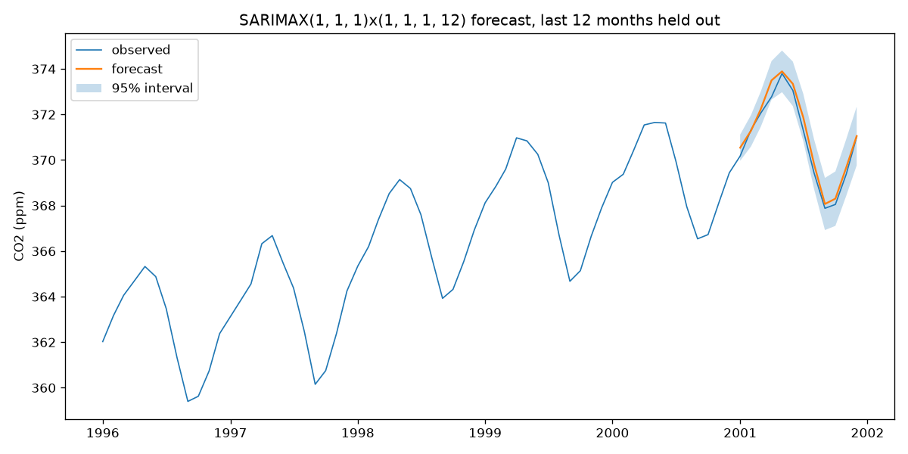
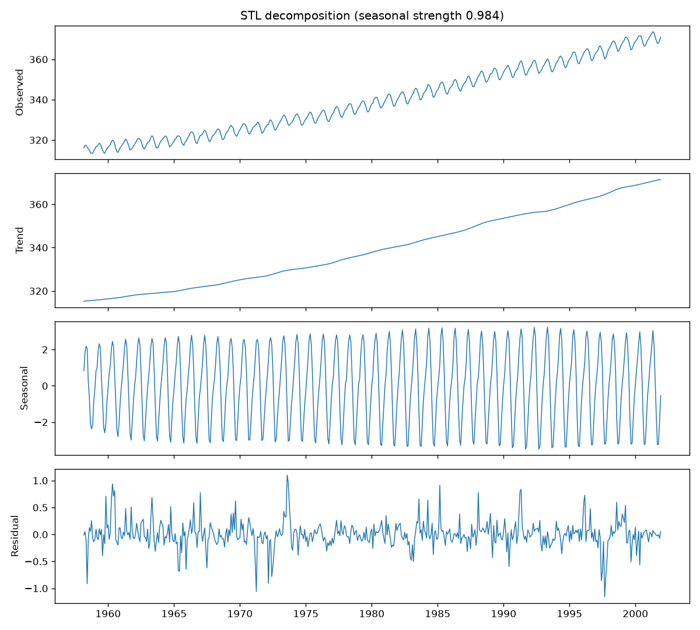

# time-series-forecasting

Classical time-series forecasting in Python: seasonal-trend decomposition, ARIMA/SARIMAX models, and a walk-forward (expanding-window) backtester with RMSE, MAE, and MAPE. Built as a small, typed package (`tsforecast`) on top of statsmodels.

The headline demo forecasts the Mauna Loa atmospheric CO2 monthly series that ships with statsmodels, so the package, tests, and demo all run fully offline. Two macro series from FRED (CPI and 10-year breakeven inflation) can optionally be downloaded for further experiments.

## What it does

- `tsforecast.data`: loads the bundled CO2 series as a clean monthly series, and parses FRED CSV exports
- `tsforecast.decompose`: STL and classical decomposition with a seasonal-strength statistic
- `tsforecast.forecast`: `SarimaxForecaster`, a fit/forecast wrapper around statsmodels SARIMAX that returns point forecasts with confidence intervals
- `tsforecast.backtest`: expanding-window split generator and `walk_forward_backtest`, which refits the model at each fold and scores every held-out point
- `tsforecast.metrics`: RMSE, MAE, MAPE with input validation

## What it does not do

- No automatic order selection (no auto-ARIMA); orders are chosen by the user
- No exogenous regressors in the backtester, univariate series only
- No machine-learning or deep-learning models, this is deliberately a classical statistics project

## Install

```
git clone https://github.com/aamirmalik-dr/time-series-forecasting.git
cd time-series-forecasting
python -m venv .venv
.venv\Scripts\activate        # Windows; on Linux/macOS: source .venv/bin/activate
pip install -e ".[dev]"
```

Requires Python 3.11 or later.

## Run the demo

```
python scripts/forecast.py
```

This loads the CO2 series (526 monthly observations, 1958-03 to 2001-12), writes three figures to `results/` (STL decomposition, forecast vs actual with a 95 percent interval, residual diagnostics), and runs the walk-forward backtest.

Optionally fetch the FRED series (needs network, everything else works without it):

```
python scripts/download_data.py
```

There is also a walkthrough notebook at `notebooks/demo.ipynb` with saved outputs.

## Results

Verified output from `scripts/forecast.py` on the bundled CO2 series, SARIMAX(1,1,1)x(1,1,1,12), walk-forward backtest over the last 60 months (5 expanding-window folds, 12-month horizon per fold, model refit at every fold):

| Metric | Value |
| --- | --- |
| RMSE | 0.656 ppm |
| MAE | 0.506 ppm |
| MAPE | 0.138% |

STL seasonal strength of the series is 0.984, so a large seasonal component in the model is well justified. Errors this small are expected for a series as regular as CO2; the point of the demo is the methodology (honest out-of-sample evaluation with refitting), not a hard forecasting problem.

Forecast of the final held-out year:



STL decomposition of the full series:



## Quick example

```python
from tsforecast import SarimaxForecaster, load_co2_monthly, walk_forward_backtest

series = load_co2_monthly()

# single fit and forecast
model = SarimaxForecaster(order=(1, 1, 1), seasonal_order=(1, 1, 1, 12)).fit(series)
forecast = model.forecast(steps=12)   # .mean, .lower, .upper

# walk-forward backtest
result = walk_forward_backtest(
    series, order=(1, 1, 1), seasonal_order=(1, 1, 1, 12),
    initial_train_size=len(series) - 60, horizon=12,
)
print(result.summary())
```

## Tests and linting

```
pytest -q                        # 32 tests
ruff check src tests scripts
```

## Project layout

```
src/tsforecast/     library code (data, decompose, forecast, backtest, metrics)
scripts/            forecast.py demo, download_data.py optional FRED fetch
notebooks/          demo.ipynb walkthrough with saved outputs
tests/              pytest suite
docs/               figures used in this README
data/               gitignored, see data/README.md
```

## Author

Aamir Malik

- GitHub: https://github.com/aamirmalik-dr
- LinkedIn: https://linkedin.com/in/dr-aamirmalik

## License

MIT, see [LICENSE](LICENSE).
