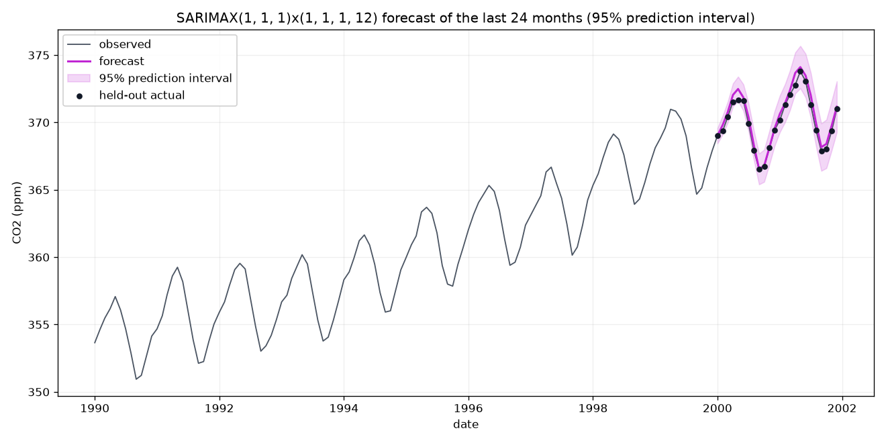

# time-series-forecasting



SARIMAX(1,1,1)x(1,1,1,12) forecasting the last 24 months of the Mauna Loa CO2
series. The line is the point forecast, the band is the 95 percent prediction
interval, and the dots are the held-out actuals the model never saw. All 24
land inside the band. The figure above is regenerated by one command and ships
committed in `results/`.

```
python scripts/forecast.py forecast --horizon 24
```

That command runs fully offline on the committed sample, writes the figure and
a `results/forecast.csv` you can inspect, and prints the held-out error. No
download, no API key, no network.

## What you are looking at

`tsforecast` is a small, typed forecasting application built on statsmodels. It
does three operational things and commits the outputs so you can see them
before running anything:

| Artifact | File | What it shows |
| --- | --- | --- |
| Hero forecast | `results/forecast.png` | 24-month forecast with 95 percent interval and held-out actuals |
| Saved forecast | `results/forecast.csv` | date, forecast, lower_95, upper_95, actual, abs_error |
| Backtest metrics | `results/metrics.json` | walk-forward RMSE, MAE, MAPE over 60 months |
| STL decomposition | `results/decomposition.png` | trend, seasonal, residual, seasonal strength |
| Residual diagnostics | `results/residual_diagnostics.png` | standardized residuals, ACF, histogram, Q-Q |

## Measured results

Produced in a fresh environment from the committed sample, SARIMAX(1,1,1)x(1,1,1,12).

Walk-forward backtest, 5 expanding-window folds over the last 60 months, model
refit at every fold, 12-month horizon per fold:

| Metric | Value |
| --- | --- |
| RMSE | 0.656 ppm |
| MAE | 0.507 ppm |
| MAPE | 0.138 percent |

Hero window (last 24 months, one fit): mean absolute error 0.351 ppm, max 0.896
ppm, and all 24 actuals fall inside the 95 percent interval. Full-series fit:
AIC 214.3, STL seasonal strength 0.984, Ljung-Box(12) p-value 0.982 so the
residuals read as white noise. See `model_card.md` for the full spec and
backtest protocol.

CO2 is an unusually regular series, so these errors are small by design. The
point of the project is the operational method, honest refit-every-fold
backtesting and calibrated intervals, not a hard forecasting problem.

## Command-line interface

The entry point is `scripts/forecast.py` with four subcommands. Every command
defaults to the committed offline sample.

```
python scripts/forecast.py forecast --horizon 24        # fit, forecast, write forecast.png + forecast.csv
python scripts/forecast.py backtest --horizon 12 --holdout 60   # walk-forward, write metrics.json
python scripts/forecast.py figures --horizon 24         # regenerate all three figures
python scripts/forecast.py diagnostics --lags 12        # print residual white-noise test
```

Shared flags let you change the model without touching code:

```
python scripts/forecast.py forecast --order 2,1,2 --seasonal-order 0,1,1,12 --horizon 12
python scripts/forecast.py backtest --data data/CPIAUCSL.csv --column CPIAUCSL --holdout 48
```

A `Makefile` wraps the common targets: `make forecast`, `make backtest`,
`make figures`, `make diagnostics`, `make test`, `make lint`.

## Install

```
git clone https://github.com/aamirmalik-dr/time-series-forecasting.git
cd time-series-forecasting
python -m venv .venv
.venv\Scripts\activate        # Windows; on Linux/macOS: source .venv/bin/activate
pip install -e ".[dev]"
```

Requires Python 3.11 or later. Then run any command in the CLI section above.

## Data

The committed sample `data/co2_sample.csv` is the full monthly Mauna Loa CO2
series (526 observations, 1958-03 to 2001-12), a carved subset of the public
NOAA record that ships with statsmodels. It is a carved public subset, not
synthetic. Regenerate it with `python scripts/make_sample.py`. To experiment
with other series, `python scripts/download_data.py` fetches public FRED series
and the CLI reads them through `--data`. See `data/README.md`.

## Library

The CLI is a thin layer over the `tsforecast` package if you want to script it:

```python
from tsforecast import SarimaxForecaster, load_co2_sample, walk_forward_backtest

series = load_co2_sample()   # offline, from the committed CSV

model = SarimaxForecaster(order=(1, 1, 1), seasonal_order=(1, 1, 1, 12)).fit(series)
forecast = model.forecast(steps=12)          # .mean, .lower, .upper
diag = model.residual_diagnostics(lags=12)   # .ljung_box_pvalue, .is_white_noise()

result = walk_forward_backtest(
    series, order=(1, 1, 1), seasonal_order=(1, 1, 1, 12),
    initial_train_size=len(series) - 60, horizon=12,
)
print(result.summary())
```

Modules: `data` (offline sample loader and FRED CSV parser), `decompose` (STL
and classical with a seasonal-strength statistic), `forecast` (the SARIMAX
wrapper and residual diagnostics), `backtest` (expanding-window splitter and
walk-forward runner), `metrics` (RMSE, MAE, MAPE with validation).

## What it does not do

- No automatic order selection. Orders are chosen by the user or the defaults.
- No exogenous regressors in the backtester. Univariate series only.
- No machine-learning or deep-learning models. This is deliberately classical.

## Tests and linting

```
pytest -q                        # 40 tests
ruff check src tests scripts
```

There is also a walkthrough notebook at `notebooks/demo.ipynb` with saved
outputs.

## Project layout

```
src/tsforecast/     library code (data, decompose, forecast, backtest, metrics)
scripts/            forecast.py CLI, make_sample.py sample builder, download_data.py FRED fetch
results/            committed demo artifacts: forecast.png/csv, metrics.json, decomposition, diagnostics
data/               committed co2_sample.csv plus data/README.md
notebooks/          demo.ipynb walkthrough with saved outputs
tests/              pytest suite
model_card.md       model spec, backtest protocol, and measured results
Makefile            task runner for the CLI
```

## Author

Aamir Malik

- GitHub: https://github.com/aamirmalik-dr
- LinkedIn: https://linkedin.com/in/dr-aamirmalik

## License

MIT, see [LICENSE](LICENSE).

---

*Refactored and engineered into this tested, reproducible project in July 2026, reimplemented from scratch on public data. The underlying methods were first studied in the Data Analysis (MITx 6.419x) course.*
